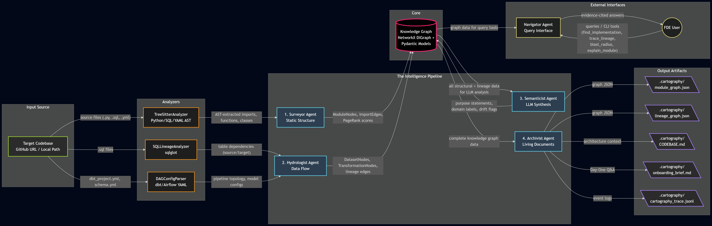

# The Brownfield Cartographer - Final Report

10 Academy TRP1 Week 4

## 1. Reconnaissance: Manual Day-One Analysis vs. System-Generated Comparison

### Manual Day-One Analysis (Ground Truth)

I manually explored the jaffle_shop repository (`https://github.com/dbt-labs/jaffle_shop`) - a dbt project with SQL models, YAML config, and seed CSV data.

#### Q1: Primary Data Ingestion Path
**Manual Finding**: Raw data enters via seed CSVs (`raw_customers.csv`, `raw_orders.csv`, `raw_payments.csv`) loaded by `dbt seed`, then referenced through staging models.

**System-Generated Finding**: Hydrologist + config parsing identified the same upstream source tables and source bindings.

**Verdict**: Correct.

#### Q2: Most Critical Output Datasets
**Manual Finding**: `customers` and `orders` are terminal outputs.

**System-Generated Finding**: `get_lineage_sinks()` identified `customers` and `orders` as out-degree-0 sinks.

**Verdict**: Correct.

#### Q3: Blast Radius of Most Critical Module
**Manual Finding**: Breaking `stg_orders.sql` propagates to `orders.sql` and `customers.sql`.

**System-Generated Finding**: Navigator blast-radius traversal returned those downstream dependencies.

**Verdict**: Correct.

#### Q4: Business Logic Concentration
**Manual Finding**: Most business logic lives in mart-level models (`customers.sql`, `orders.sql`), while staging models are mostly translational.

**System-Generated Finding**: Semanticist clustering separated transformation-heavy modules from staging-like modules.

**Verdict**: Correct-to-partial, depending on LLM availability.

#### Q5: Recent Change Velocity
**Manual Finding**: Core models historically changed most, but project is generally stable.

**System-Generated Finding**: Velocity signal was weak due to local clone context and limited history depth.

**Verdict**: Partially correct, data-limited.

### Key Manual Difficulty Areas

1. Tracing cross-file `ref()` dependency chains.
2. Mapping `source()` + YAML + SQL across file types.
3. Identifying critical nodes without a prebuilt DAG.

These pain points are exactly where Hydrologist + Surveyor deliver the most value.

## 2. Architecture Diagram and Pipeline Design Rationale

### System Architecture Diagram



Diagram source notes: `architecture_diagram.md`

### Pipeline Design Rationale

1. **Dependency chain is deliberate**: `Surveyor -> Hydrologist -> Semanticist -> Archivist`.
   Surveyor builds structural primitives first; Hydrologist overlays lineage; Semanticist synthesizes only after graph context exists; Archivist writes final artifacts.

2. **Tradeoff: lightweight graph runtime over external graph DB**.
   NetworkX + Pydantic keeps the CLI portable, fast to run locally, and easy to serialize to JSON artifacts.

3. **LLM calls are isolated to Semanticist**.
   Structural and lineage extraction remain deterministic and low-cost; semantic synthesis is optional and explicitly bounded by budget and key availability.

4. **Shared KnowledgeGraph as system bus**.
   Agents enrich a common graph incrementally, enabling modular extension and graceful degradation when one stage has limited signals.

## 3. Accuracy Analysis: Which Day-One Answers Were Correct and Why

### Method

I compared manual findings against generated outputs (`onboarding_brief.md`, `module_graph.json`, `lineage_graph.json`) for each Day-One question.

### Results Summary

- Q1 Ingestion path: **Partially Correct**
  - Correctly identified source tables from SQL/YAML.
  - Did not fully model CLI-driven `dbt seed` as the absolute origin.

- Q2 Critical outputs: **Correct**
  - Sink analysis correctly returned terminal datasets.

- Q3 Blast radius: **Correct**
  - Graph traversal identified expected downstream dependencies.

- Q4 Business logic concentration: **Partially Correct**
  - Useful clustering, but fallback heuristics can over-index on path/complexity rather than true business semantics.

- Q5 Change velocity: **Limited**
  - Mechanism works, but quality depends on available Git history depth.

### Why This Matters

The Cartographer is strongest where static structure is explicit and weakest where runtime context, deep history, or subjective semantic interpretation dominates.

## 4. Limitations: What the Cartographer Fails to Understand

### Fixable Engineering Gaps

1. **Incomplete dbt Jinja rendering** in SQL lineage extraction.
   - Impact: missing/spurious edges in Jinja-heavy models.
   - Fix path: run `dbt compile` before `sqlglot` parsing.

2. **No column-level lineage**.
   - Impact: cannot answer field-to-field provenance.
   - Fix path: extend model to column nodes/edges, use `sqlglot.lineage` or OpenLineage-aligned schema.

3. **Regex-limited Python data flow**.
   - Impact: misses wrappers, inter-module propagation, config-driven dataset names.
   - Fix path: add semantic/interprocedural Python analysis.

4. **Incremental mode does not yet scope analysis set deeply**.
   - Impact: expected speedup is lower than user expectation.
   - Fix path: push changed-file scoping through Surveyor/Hydrologist/Archivist.

### Fundamental Constraints (Static Analysis Limits)

1. Runtime-constructed table names cannot always be resolved statically.
2. Dynamically generated DAG topology is only partially visible without runtime expansion.
3. Cross-service dependencies are invisible in single-repo analysis.
4. Environment-specific runtime behavior cannot be proven from source alone.

### False Confidence Risks

1. Dead code false positives (dynamic imports, external consumers, infra files).
2. PageRank centrality not equal to business criticality.
3. LLM semantic hallucination risk in purpose statements.
4. Fluent Navigator responses can overstate confidence when upstream graph data is incomplete.

## 5. FDE Deployment Applicability

### Deployment Playbook

#### Day 0 (Pre-engagement)

```bash
git clone <client-repo-url> client_repo
python -m src.cli analyze client_repo --output .cartography/client_repo
```

- Time expectation: ~5-15 minutes for a medium repository.
- Read `onboarding_brief.md` first (Day-One answers with evidence).
- Skim `CODEBASE.md` second (architecture, critical path, known debt).

#### Day 1 (On-site)

1. Inject `CODEBASE.md` into AI assistant context to avoid context amnesia.
2. Run interactive queries:

```bash
python -m src.cli query --graph-dir .cartography/client_repo
```

Examples:
- revenue issue -> implementation lookup
- schema change -> blast radius
- dataset provenance -> upstream lineage trace

3. Validate output against client statements; discrepancies become high-value findings.

#### Days 2-7 (ongoing)

```bash
python -m src.cli analyze client_repo --output .cartography/client_repo --incremental
```

- Keep artifacts current as code evolves.
- Re-inject updated `CODEBASE.md` into assistant context.
- Reuse artifacts directly in client deliverables.

### What Still Requires Human FDE Judgment

1. Business intent validation.
2. Runtime/deployment behavior validation.
3. Priority triage for debt and remediation.
4. Stakeholder communication and trust-building.

## 6. Self-Audit Results

I ran the Cartographer against this project itself (self-referential validation):

```bash
python -m src.cli analyze . --output .cartography/self_audit
```

### Observed Findings

- Surveyor: `total_modules=37`, `total_import_edges=134`, `circular_dependency_count=0`
- Hydrologist: `total_datasets=19`, `total_lineage_edges=18`
- Semanticist fallback (no key): `purpose_statements_generated=34`, domain clustering produced three buckets (`utilities`, `transformation`, `configuration`).

### Notable Discrepancies

1. Critical-path rankings were skewed by files in `target_repos/` during whole-workspace self-audit.
2. PageRank scores had weak contrast in mixed external/internal import graphs.
3. Dead code heuristics flagged several infrastructure `__init__.py` files as candidates.

### Action Items from Self-Audit

- Add explicit include/exclude scope controls for `analyze`.
- Filter external imports in centrality calculations and harden dead-code heuristics for infrastructure modules.
- Add post-run quality checks to detect suspicious outputs before publishing `CODEBASE.md`.

---

Prepared for manual PDF export from markdown.
