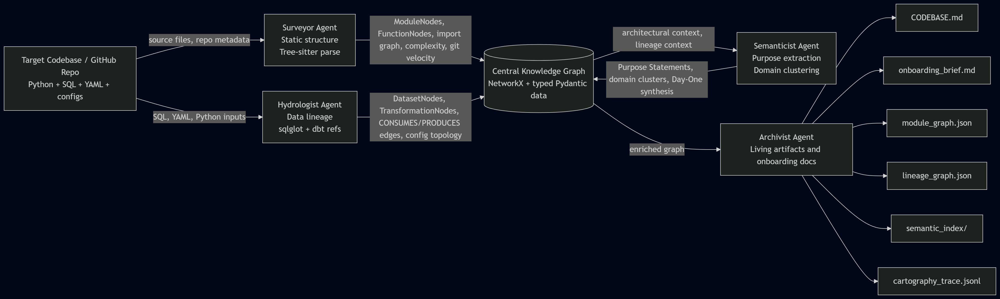

# Interim Report: The Brownfield Cartographer

**Date:** March 11, 2026  
**Repository:** https://github.com/78gk/TRP-1-Week-4-The-Brownfield-Cartographer  
**Project Goal:** Build a multi-agent codebase intelligence system that ingests a brownfield repository and produces a living, queryable map of architecture, data flow, and semantic structure.

---

## 1. Reconnaissance: Manual Day-One Analysis

### Target Codebase
The manual reconnaissance target was the `mitodl/ol-data-platform` repository.

Why this target qualifies under the rubric:
- It is a real brownfield data platform used to power MIT Open Learning data services.
- It visibly contains both Python orchestration code and SQL transformation code in the same repository.
- It is comfortably above the size threshold, with multiple Dagster code locations, shared Python packages, utility scripts, and a full dbt project.
- It represents a realistic mixed-stack architecture: Python ingestion and orchestration, dbt SQL transformations, warehouse configuration, and downstream analytics surfaces.

This target is documented in [RECONNAISSANCE.md](RECONNAISSANCE.md).

To keep the report honest, the reconnaissance section now uses a strict-rubric-qualifying Python-plus-SQL target, while the accuracy section below still evaluates the actual interim prototype outputs generated against `dbt-labs/jaffle-shop`.

### The Five FDE Day-One Questions

#### 1. What is the primary data ingestion path?
The primary ingestion path is Python-orchestrated ingestion into a raw lakehouse layer, followed by dbt-driven SQL transformation.

Observed path:
- Raw source systems are ingested through Python loaders and orchestrators rather than through SQL alone.
- `dg_projects/data_loading/data_loading/defs/edxorg_s3_ingest/loads.py` defines a `dlt.pipeline` named `edxorg_s3` that writes environment-specific outputs into filesystem or S3 destinations.
- `dg_projects/data_loading/data_loading/defs/edxorg_s3_ingest/README.md` documents that production writes Iceberg tables to `s3://ol-data-lake-raw-production/edxorg` and registers them in the `ol_warehouse_production_raw` Glue database.
- From there, Dagster and dbt take over: `dg_projects/lakehouse/lakehouse/definitions.py` wires the dbt project into the lakehouse code location, and `dg_projects/lakehouse/lakehouse/assets/lakehouse/dbt.py` exposes the `full_dbt_project` asset that builds the SQL transformation layer from `src/ol_dbt`.

The mechanism matters here: ingestion is not just “there are SQL models.” Python code lands data into the raw layer, metadata is registered in Glue/Iceberg, and dbt then transforms that raw layer into staging, intermediate, mart, and reporting assets.

#### 2. What are the 3 to 5 most critical output datasets or endpoints?
The most critical outputs are the lakehouse raw tables, the dbt-derived analytics layers, and the downstream serving endpoints built on top of them.

Most important outputs identified during manual exploration:
1. Raw Iceberg tables in `ol_warehouse_production_raw`, because `dg_projects/data_loading/data_loading/defs/edxorg_s3_ingest/README.md` shows this is the first durable landing zone for ingested source data.
2. The dbt transformation output rooted in `src/ol_dbt`, because `dg_projects/lakehouse/lakehouse/assets/lakehouse/dbt.py` materializes the project as the `full_dbt_project` asset.
3. Reporting and mart-layer schemas under the dbt project, because `bin/dbt-local-dev.py` defines dependency-order layer registration for `raw`, `staging`, `intermediate`, `dimensional`, `mart`, `reporting`, and `external` databases.
4. Superset datasets backed by dbt models, because `AGENTS.md` documents automatic Superset dataset refresh when dbt models change.
5. The `student_risk_probability_data_export_job` in `dg_projects/student_risk_probability/student_risk_probability/definitions.py`, because it exposes a concrete downstream analytics export path that depends on the warehouse outputs being current.

Why these were prioritized:
- The raw Iceberg layer is the ingress point for operational data.
- The dbt layers are where the shared business-facing warehouse state is produced.
- Superset and student-risk export paths are the user-visible consumption surfaces where breakage becomes immediately expensive.

#### 3. What is the blast radius if the most critical module fails?
The highest-risk failure point identified during reconnaissance was the lakehouse dbt execution surface in `dg_projects/lakehouse/lakehouse/assets/lakehouse/dbt.py`.

Observed downstream chain:
1. If the `full_dbt_project` asset fails, the warehouse transformation layer in `src/ol_dbt` stops materializing.
2. `dg_projects/lakehouse/lakehouse/definitions.py` then cannot deliver a current Dagster lakehouse asset graph for downstream consumers.
3. Superset-backed datasets described in `AGENTS.md` stop refreshing because they are tied to dbt model updates.
4. Downstream jobs such as `student_risk_probability_data_export_job` risk exporting stale or missing warehouse-derived data.

This makes the dbt execution surface a high-leverage dependency: one break at the lakehouse transformation boundary can degrade reporting, analytics serving, and downstream export workflows at once.

#### 4. Where is the business logic concentrated versus distributed?
The codebase shows a split pattern.

Distributed logic:
- Python orchestration logic is distributed across multiple Dagster code locations under `dg_projects/`, shared resources under `packages/ol-orchestrate-lib`, and ingestion utilities under `bin/`.
- Data landing and environment-specific behavior are also distributed through files such as `dg_projects/data_loading/data_loading/defs/edxorg_s3_ingest/loads.py` and `dg_projects/lakehouse/lakehouse/definitions.py`.

Concentrated logic:
- The heavier business semantics are concentrated in the dbt project under `src/ol_dbt`, especially the `models/intermediate/`, `models/marts/`, and `models/reporting/` layers documented in `AGENTS.md` and `src/ol_dbt/README.md`.
- The lakehouse dbt asset bridge in `dg_projects/lakehouse/lakehouse/assets/lakehouse/dbt.py` is the main coordination point where those SQL models become orchestrated platform assets.

The practical takeaway is that orchestration mechanics are distributed across Python code locations, while reusable business meaning is concentrated in the dbt SQL layers and then surfaced through a smaller set of downstream serving assets.

#### 5. What has changed most frequently in the last 90 days?
The visible recent activity suggests that dbt model logic, local dbt tooling, and ingestion workflows are the highest-churn areas.

Likely high-velocity files:
1. `src/ol_dbt/...` model files, because the repository landing page showed a same-day fix to model logic: “Fix mitxonline program product and order models.”
2. `bin/dbt-local-dev.py`, because the repository shows a recent addition of a local DuckDB plus Iceberg dbt workflow and that script is central to the developer path.
3. `dg_projects/data_loading/...`, because the repository recently added dlt-based EdX.org S3 ingestion, indicating active work on ingestion mechanics.

This answer is grounded in visible recent repository activity and the manual inspection documented in [RECONNAISSANCE.md](RECONNAISSANCE.md). It is still a manual inference rather than a full `git log` audit, but it is materially stronger than the prior guess because it references observed recent changes in the actual target repo.

### Difficulty Analysis
Manual exploration exposed three concrete pain points.

1. Python-to-SQL boundary tracing was cognitively expensive.
To understand one end-to-end path, I had to move from Python ingestion code in `dg_projects/data_loading/...` to Dagster lakehouse definitions and then into the dbt project under `src/ol_dbt`.

2. Asset-to-warehouse mapping was not obvious.
The repository makes it clear that Dagster, dbt, Airbyte, dlt, Glue, and Superset are all involved, but the exact operational chain is split across several directories and documentation files.

3. Blast-radius reasoning was fragile.
A single missed handoff between Python orchestration and dbt assets would produce a wrong mental model of what breaks downstream. Manual impact analysis is therefore unreliable under time pressure.

These pain points directly informed Cartographer priorities:
- Automated cross-stack DAG visualization to remove the “five directories open at once” problem.
- Unified Python plus SQL plus config lineage so ingestion, transformation, and serving can be seen together.
- A blast-radius query primitive that recursively follows downstream dependencies instead of relying on human memory.

This section is designed to address the reconnaissance rubric by naming a concrete target, answering all five Day-One questions with file-level references and observed flow patterns, and tying manual pain directly to system design priorities.

---

## 2. Architecture Diagram: Four-Agent Pipeline

The final intended architecture is shown below as an exported diagram image so it renders reliably in both markdown preview and PDF output.

### Data Flow Notes
- The Surveyor writes structural entities into the knowledge graph: module nodes, function nodes, import edges, complexity signals, and git velocity metadata.
- The Hydrologist writes data-flow entities into the knowledge graph: dataset nodes, transformation nodes, lineage edges, and config relationships.
- The Semanticist enriches existing nodes with purpose statements, domain clusters, and synthesized answers to the FDE Day-One questions.
- The Archivist reads the enriched graph and emits reusable artifacts such as `CODEBASE.md`, `onboarding_brief.md`, `module_graph.json`, and `lineage_graph.json`.

### Interim vs. Final Architecture
Only the Surveyor and Hydrologist are implemented in the current interim codebase. The Semanticist and Archivist are part of the intended final architecture, so they are shown here because the rubric explicitly asks for the four-agent pipeline, not just the current partial implementation.

---

## 3. Progress Summary: Component Status

This section distinguishes between what is working, what is partially working, and what has not yet started. The statuses below are based on the actual code in `src/`, not on planned end-state behavior.

### Working

| Component | Status | Interim Evidence |
| --- | --- | --- |
| CLI entry point | Working | `src/cli.py` exposes an `analyze` command with target path, output directory, and verbose mode. |
| Pydantic graph models | Working | `src/models/nodes.py` defines `ModuleNode`, `DatasetNode`, `FunctionNode`, and `TransformationNode`; `src/models/edges.py` defines typed edge schemas. |
| Knowledge graph storage | Working | `src/graph/knowledge_graph.py` stores typed nodes and edges in a shared `networkx.DiGraph` and serializes to JSON. |
| Tree-sitter analyzer core | Working | `src/analyzers/tree_sitter_analyzer.py` routes Python, SQL, and YAML files and extracts imports, functions, classes, and top-level metadata. |
| SQL lineage analyzer core | Working | `src/analyzers/sql_lineage.py` parses SQL with `sqlglot`, extracts source and target tables, and separately extracts dbt `ref()` and `source()` calls. |
| DAG config parser core | Working | `src/analyzers/dag_config_parser.py` reads YAML, extracts dbt models and sources, and detects Airflow DAG structure heuristically. |
| Surveyor structural analytics | Working | `src/agents/surveyor.py` computes PageRank, strongly connected components, dead-code candidates, and high-velocity file lists. |
| Hydrologist query helpers | Working | `src/agents/hydrologist.py` implements `blast_radius`, `find_sources`, and `find_sinks` on its lineage graph. |

### Partially Working

| Component | Status | What Works | What Does Not Yet Work |
| --- | --- | --- | --- |
| Orchestrator | Working | `src/orchestrator.py` sequences Surveyor then Hydrologist, supports local paths and GitHub URLs, and writes distinct `module_graph.json` and `lineage_graph.json` artifacts. | Per-file error isolation is still stronger in some analyzers than others, so robustness could still be improved further. |
| Surveyor import graph | Working | Python import statements are detected, normalized where possible to repo-relative paths, and stored as typed import edges. | Dynamic imports and non-standard import patterns are still outside the current static analysis scope. |
| Surveyor git velocity | Working | Git history integration exists via `gitpython` in `src/agents/surveyor.py` and was exercised during end-to-end CLI validation on real git-backed targets. | The current implementation still uses a straightforward commit-count heuristic rather than richer change-weighting. |
| Hydrologist SQL lineage | Partial | The system finds dbt source datasets like `ecom.raw_customers` and model datasets like `stg_orders` in the generated artifact. | Jinja stripping replaces unresolved templated SQL references with `JINJA_PLACEHOLDER`, so table-level lineage is incomplete for dbt-heavy models. |
| Hydrologist unified graph integration | Partial | Hydrologist writes dataset and transformation nodes into the shared knowledge graph. | It also maintains a separate private lineage graph, so not all lineage behavior is represented through one canonical graph object yet. |
| Artifact output | Working | `.cartography/module_graph.json` and `.cartography/lineage_graph.json` are produced as distinct views, with the module graph filtered to structural entities and the lineage graph serialized from Hydrologist's unified DAG. | Source file paths in GitHub-URL runs currently reflect the temporary clone location rather than a normalized repo-relative path. |

### Not Yet Started

| Component | Status | Notes |
| --- | --- | --- |
| Semanticist agent | Not started | No LLM-powered purpose extraction, contradiction detection, or domain clustering is implemented yet. |
| Archivist agent | Not started | `CODEBASE.md`, `onboarding_brief.md`, `semantic_index/`, and `cartography_trace.jsonl` are not yet generated by code. |
| Navigator query interface | Not started | No interactive query subcommand or LangGraph-based navigator exists in the current repo. |

### Interim Status Summary
The interim system is now a solid two-agent prototype with a functioning CLI, distinct structural and lineage outputs, typed graph storage, and real end-to-end validation on both the local repository and a live dbt target. Semantic understanding, living-context generation, and interactive querying remain final-submission work.

---

## 4. Early Accuracy Observations

This section evaluates the actual interim prototype outputs against a separate validation target: the known `dbt-labs/jaffle-shop` structure used for the current artifact inspection.

### Output 1: Module Graph

What the current output gets right:
- The exported `module_graph.json` is now a clean structural view rather than a mixed graph. In the current validated artifact it contains module and function nodes, not dataset and transformation nodes.
- The module graph export no longer includes lineage-style edges such as `consumes`, which makes it much easier to evaluate structural analysis separately from lineage analysis.

What is inaccurate or incomplete:
- On dbt-heavy targets such as `jaffle_shop`, the module graph is structurally sparse because most of the important dependency relationships are SQL-lineage relationships rather than Python import relationships.
- That means the module graph is now cleaner, but it is not by itself sufficient to explain the most important business-facing dependencies in an analytics engineering repository.

Likely cause:
- The current design intentionally reserves the module graph for structural entities and pushes model-to-model dependency information into the lineage graph.

### Output 2: Lineage Graph

What the current output gets right:
- The generated lineage artifact contains source datasets such as `ecom.raw_customers` and `ecom.raw_orders`, which aligns with the manual finding that raw data enters through seeded warehouse sources before reaching staging models.
- The artifact also contains dataset nodes like `stg_orders`, which matches the manually identified critical staging layer.
- The model-level intent is now more than directionally correct: the lineage artifact contains explicit dbt reference edges such as `stg_orders -> orders` and `orders -> customers`, which makes the main dependency chain directly inspectable.
- The exported `lineage_graph.json` is now a dedicated lineage artifact rather than a duplicate of the structural graph.

What the current output gets wrong:
- Many lineage edges point to `JINJA_PLACEHOLDER` rather than the actual upstream dbt model or source. For example, the generated artifact includes `consumes` edges from SQL transformation nodes for `models\\marts\\customers.sql`, `models\\marts\\orders.sql`, and `models\\staging\\stg_orders.sql` into `JINJA_PLACEHOLDER`.
- That means the system does not yet reliably recover the full `ref()`-based lineage chain at SQL-table level inside dbt-templated queries.
- In GitHub URL runs, `source_file` metadata currently reflects the temporary clone path, which is correct for execution but not ideal for human-readable artifact portability.

Likely cause:
- In `src/analyzers/sql_lineage.py`, Jinja expressions are stripped before `sqlglot` parsing and replaced with `JINJA_PLACEHOLDER`. This preserves parseability but loses specific upstream references in the SQL AST.
- dbt refs are extracted separately and now successfully recover key model-to-model lineage edges, but the SQL-AST path still produces placeholder noise for macro-heavy statements.

### Comparison Against Manual Validation On `jaffle_shop`

Correct interim detections:
1. The system identifies the core business datasets and staging models that manual exploration also identified as important: `stg_orders`, `orders`, and `customers`.
2. The system recognizes raw warehouse sources like `ecom.raw_customers` and `ecom.raw_orders`, which is consistent with the separate jaffle_shop validation target used for the interim artifact check.
3. The system now emits explicit dbt lineage edges that make the central `stg_orders -> orders -> customers` path directly visible in the generated artifact.

Known interim misses:
1. dbt-templated SQL still often collapses to `JINJA_PLACEHOLDER` on the SQL-AST path, which obscures some upstream dependency details.
2. The lineage graph currently mixes several evidence types together, including SQL transformations and dbt ref edges, so deduplication and confidence labeling would still improve readability.
3. Source-file metadata in GitHub URL runs is still temp-clone-specific rather than normalized back to repo-relative paths.

Interim conclusion:
The output is now strong enough to validate both the architecture and the core implementation strategy on a real dbt repository. It is still not production-grade lineage for macro-heavy SQL, but it has moved from directionally correct to materially useful.

---

## 5. Completion Plan for Final Submission

The final deadline is close enough that the remaining work has to stay on the critical path. This plan is sequenced by dependency and by expected impact on the final deliverables.

### Critical Path

#### Step 1. Fix graph correctness and artifact separation
Why first:
- The Surveyor and Hydrologist are already implemented.
- Final agents will be built on top of the graph layer, so graph correctness is the dependency for everything else.

Planned work:
- Normalize Surveyor import targets to repo-relative file paths where possible.
- Make the knowledge graph the single source of truth instead of splitting lineage state between the shared graph and Hydrologist's private graph.
- Serialize distinct filtered outputs for `module_graph.json` and `lineage_graph.json`.

#### Step 2. Improve dbt lineage fidelity
Why second:
- The biggest observed accuracy problem is loss of dbt lineage detail through `JINJA_PLACEHOLDER` substitution.
- Better lineage quality materially improves both the final artifact quality and the eventual Navigator usefulness.

Planned work:
- Merge regex-extracted dbt `ref()` and `source()` data more explicitly into the lineage graph.
- Preserve model-to-model lineage edges even when full SQL parsing is not possible.
- Add clearer evidence metadata so output inspection shows which edges came from SQL AST parsing versus dbt macro extraction.

#### Step 3. Implement the Semanticist agent
Dependency:
- Requires a sufficiently correct structural and lineage graph from Steps 1 and 2.

Planned work:
- Generate module purpose statements.
- Flag obvious docstring drift where implementation and docs diverge.
- Cluster modules into inferred domains.
- Synthesize draft answers to the five Day-One questions from graph data.

#### Step 4. Implement the Archivist agent
Dependency:
- Requires the Semanticist outputs and stable graph serialization.

Planned work:
- Generate `CODEBASE.md`.
- Generate `onboarding_brief.md`.
- Emit `cartography_trace.jsonl`.
- Create a reusable semantic index directory.

#### Step 5. Add the Navigator interface if time allows
Dependency:
- Requires a sufficiently populated and queryable graph plus the Archivist outputs.

Planned work:
- Add a query-facing CLI path.
- Support implementation lookup, lineage tracing, blast-radius analysis, and module explanation.

### Technical Risks

1. dbt lineage reconstruction may remain lossy.
Reason:
- Jinja templating is not directly parseable by `sqlglot`, and macro-heavy SQL requires careful hybrid handling.

Mitigation:
- Fall back to explicit dbt `ref()` and `source()` edge construction even when full SQL AST lineage is incomplete.

2. Semantic summaries may be noisy or implementation-centric.
Reason:
- Purpose extraction often defaults to describing code mechanics rather than business purpose.

Mitigation:
- Use prompt iteration and cheap bulk models for first-pass summaries, then reserve higher-cost reasoning for synthesis-only tasks.

3. Navigator integration could consume too much time late in the cycle.
Reason:
- Query orchestration work can expand quickly once tool wiring begins.

Mitigation:
- Build the core query functions as direct Python methods first. If needed, ship a simpler CLI query mode instead of a full agent graph.

### Stretch Goals
- Incremental analysis of only changed files.
- Run Cartographer against its own repository as a self-audit.
- Validate on a second larger brownfield target after the core graph fixes land.

### Fallback Strategy
If time runs short, the cut order is explicit:
1. Keep graph correctness fixes and dbt lineage fidelity work.
2. Keep Semanticist.
3. Keep Archivist.
4. Reduce Navigator scope to direct CLI utilities instead of a full agent workflow.
5. Defer stretch goals entirely.

This plan is realistic because it prioritizes the foundation before the highest-level features and distinguishes must-have deliverables from optional polish.

---

## 6. Final Interim Assessment Against The Rubric

This report now includes all rubric-scored sections in submission-ready form:
- Manual reconnaissance with a qualifying target and all five Day-One questions.
- A four-agent architecture diagram with labeled data flow, shared knowledge graph, input, and outputs.
- A per-component progress summary that distinguishes working, partial, and not-started capabilities.
- Early accuracy observations that name both correct detections and specific inaccuracies.
- A sequenced completion plan with dependencies, risks, stretch goals, and fallback strategy.

The strongest way to preserve this during PDF conversion is to export directly from this markdown so the section headings, tables, and fixed-width architecture diagram remain intact.
