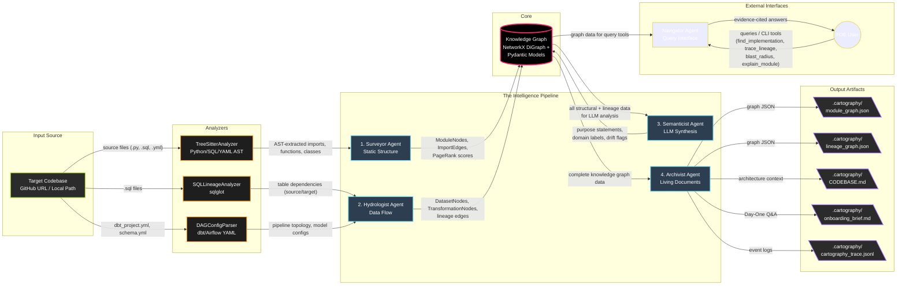

# The Brownfield Cartographer: System Architecture

## Architectural Rationale

### 1. The Sequential Pipeline Dependency Chain
The system runs strictly in order: **Surveyor → Hydrologist → Semanticist → Archivist**. 
This sequence is mathematically required by the flow of data:
* **The Surveyor** must build the structural baseline (the module topology and PageRank) before anything else can be understood.
* **The Hydrologist** layers dataset endpoints and pipeline DAG structures logically on top of the imported modules.
* **The Semanticist** requires *both* pipelines (PageRank to know what's critical, and Lineage to trace inputs/outputs) to successfully answer complex queries like blast radius or day-one onboarding insights without hallucinating.
* **The Archivist** is a pure downstream view layer that statically renders all accumulated metadata from the preceding steps into physical, markdown-friendly artifacts.

### 2. Deferment to Phase 3 (Cost & Consistency Control)
LLM calls are intentionally restricted entirely to the **Semanticist Agent** (Phase 3). 
* Analyzing ASTs and SQL hierarchies natively via TreeSitter and `sqlglot` is magnitudes faster, more accurate (zero hallucinations), and free.
* By building a hyper-dense knowledge graph first, the LLM only receives highly targeted structural prompts (e.g., "Here is exactly what this module imports and its raw code"). This prevents the LLM from blowing out context windows trying to infer system-wide topologies manually, dropping operational costs by ensuring cheap analytical compute scales indefinitely.

### 3. NetworkX vs Graph Databases 
The system utilizes **NetworkX** tied with Pydantic schemas in memory rather than a heavy graph database (like Neo4j) because Cartography runs as an *ephemeral, lightweight CI/CLI tool*. 
* It needs to operate instantly on cloned client hardware without configuring Docker containers or remote databases.
* A single repository (even at 800,000 lines) trivially fits within NetworkX's memory limits.
* Converting NetworkX topologies directly to JSON allows standard serializability, meaning any other agentic interface can quickly deserialize the file and inherit complete graph capabilities statically.

### 4. The Knowledge Graph as the Communication Bus
State is not explicitly handed from agent to agent (e.g., `Hydrologist(Surveyor_Output)`). Instead, all agents reference the mutation of the central `KnowledgeGraph` datastore. 
This acts as a system-wide communication channel. The Surveyor injects generic nodes; the Hydrologist isolates dataset-specific edges onto those nodes; the Semanticist appends textual metadata to those same nodes. This prevents tightly coupled argument signatures across the pipeline and enables graceful degradation (if the Semanticist fails, the Archivist simply reads the Knowledge Graph missing semantic tags but still yields structurally sound topologies).
