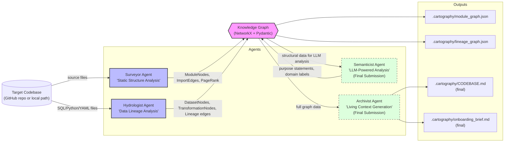

```mermaid
graph LR
    %% System Input
    Input[("Target Codebase<br/>(GitHub repo or local path)")]

    %% Central Data Store
    KG{{"Knowledge Graph<br/>(NetworkX + Pydantic)"}}

    %% Agents
    subgraph Agents
        Surveyor["Surveyor Agent<br/>'Static Structure Analysis'"]
        Hydro["Hydrologist Agent<br/>'Data Lineage Analysis'"]
        Semanticist["Semanticist Agent<br/>'LLM-Powered Analysis'<br/>(Final Submission)"]
        Archivist["Archivist Agent<br/>'Living Context Generation'<br/>(Final Submission)"]
    end

    %% Outputs
    subgraph Outputs
        M_Graph[".cartography/module_graph.json"]
        L_Graph[".cartography/lineage_graph.json"]
        C_MD[".cartography/CODEBASE.md<br/>(final)"]
        O_MD[".cartography/onboarding_brief.md<br/>(final)"]
    end

    %% Data Flows
    Input -- "source files" --> Surveyor
    Input -- "SQL/Python/YAML files" --> Hydro
    
    Surveyor -- "ModuleNodes, ImportEdges, PageRank" --> KG
    Hydro -- "DatasetNodes, TransformationNodes, Lineage edges" --> KG
    
    KG -- "structural data for LLM analysis" --> Semanticist
    KG -- "full graph data" --> Archivist
    
    Semanticist -- "purpose statements, domain labels" --> KG
    
    KG --> M_Graph
    KG --> L_Graph
    Archivist --> C_MD
    Archivist --> O_MD

    %% Styling
    classDef storage fill:#f9f,stroke:#333,stroke-width:2px
    classDef agent fill:#bbf,stroke:#333,stroke-width:2px
    classDef final fill:#dfd,stroke:#333,stroke-width:1px,stroke-dasharray: 5 5
    
    class KG storage
    class Surveyor,Hydro agent
    class Semanticist,Archivist final
```
