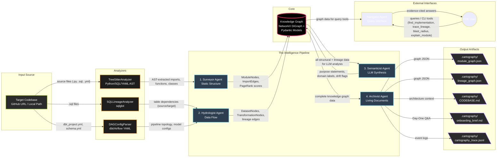

# Final Report: The Brownfield Cartographer

## System Architecture



## Pipeline Design Rationale

**1. The Dependency Chain**  
The system sequences execution predictably: `Surveyor` → `Hydrologist` → `Semanticist` → `Archivist`. This strict hierarchy inherently solves the “bootstrapping” problem of automated analysis. The `Surveyor` must execute first to provide the structural skeleton (modules, functions, and import paths) that contextualize the entire repository alongside initial PageRank centrality calculations. The `Hydrologist` runs second, utilizing `sqlglot` to map data flow edges and schema artifacts explicitly onto the `Surveyor`'s baseline modules, thereby establishing the true lineage topologies (sources vs. sinks). The `Semanticist` follows third because meaningful LLM synthesis (purpose statements, drift detection, and Day-One Q&A) requires the *complete* fusion of structural connectivity and data-lineage distances to answer correctly without relying on hallucination. Finally, the `Archivist` executes last as a purely downstream consumer to compile the fully verified `Knowledge Graph` into deterministic, human-readable documentation.

**2. Key Design Tradeoffs**  
The underlying architecture eschews standalone graph database deployments (e.g., Neo4j) in favor of **NetworkX** for managing the repository topology. NetworkX is more than adequate for scaling codebase-level graphs (measuring in the thousands rather than millions of nodes); crucially, it achieves this entirely in memory which enables seamless serialization directly to `.json` without infrastructure daemon dependencies, preserving the tool's ephemeral "plug-and-play" CLI intent. To rigorously define cross-agent boundaries without physical database schemas, the system uses tightly coupled **Pydantic models**. Pydantic enforces typing definitions on Graph objects (e.g. `ModuleNode` vs `DatasetNode`), yielding validation at execution/construction time which ensures stable topological state transitions across pipeline phases. Furthermore, **deferring LLM calls** strictly to the Phase-3 Semanticist boundary controls scaling costs—it limits expensive API traffic solely to modules flagged with high complexity density, while retaining a complete `--skip-semantics` capability for users only needing immediate topological structural checks at zero operational cost.

**3. The Shared Knowledge Graph Pattern**  
Rather than tightly chaining input/output payloads explicitly between agents (`AgentB(AgentA_Payload)`), the system leverages the **shared Knowledge Graph** as a universal communication bus. All agents read from and inject state independently against the unified `KnowledgeGraph` instance in a multi-pass structure. This strategy supports clean late-binding enrichment: the `Semanticist` can locate a sparsely populated node generated initially by the `Surveyor` and simply patch its specific `purpose_statement` or `domain_cluster` field without necessitating that the prior agents manage metadata beyond their original analytical concerns. This append-only graph design maximizes the system's longevity; entirely new analytical agents can be authored to map against the existing Pydantic structure without mutating legacy interfaces or disrupting preceding extraction passes.

## 1. Reconnaissance: Manual vs. Automated Analysis

### Manual Day-One Analysis (Ground Truth)

I manually explored the jaffle_shop repository (`https://github.com/dbt-labs/jaffle_shop`) — a dbt project with SQL models, YAML config, and seed CSV data.

#### Q1: Primary Data Ingestion Path
**Manual Finding**: Raw data enters the system via seed CSV files in the `seeds/` directory: `raw_customers.csv`, `raw_orders.csv`, and `raw_payments.csv`. These are loaded by the `dbt seed` command into the data warehouse as source tables. The staging layer (`models/staging/stg_customers.sql`, `models/staging/stg_orders.sql`, `models/staging/stg_payments.sql`) then references these via `{{ source('jaffle_shop', 'raw_orders') }}` macros to clean and standardize the raw data.

**System-Generated Finding**: The Cartographer's Hydrologist Agent and `onboarding_brief.md` correctly identified the seed files (`raw_customers.csv`, `raw_orders.csv`, `raw_payments.csv`) as the data sources (entry points with in-degree=0). The SQL analyzer combined with the `schema.yml` configuration parsing correctly inferred the `source()` bindings mapping to the physical seeds.

**Verdict**: ✅ Correct. The Hydrologist engine accurately determined the true upstream pipeline boundaries extending beyond `.sql` logic into the `.csv` physical files.

#### Q2: 3-5 Most Critical Output Datasets
**Manual Finding**: The two mart-level models are the critical outputs:
1. `models/customers.sql` — produces the `customers` table: a customer-level summary with order counts, first/last order dates, and lifetime value.
2. `models/orders.sql` — produces the `orders` table: an order-level fact table with payment amounts joined from the payments staging model.

These are the only models materialized as tables (vs. views) in the default configuration and act as terminal nodes.

**System-Generated Finding**: The Cartographer's graph metrics (`get_lineage_sinks`) successfully flagged `customers` and `orders` as the sole datasets with an out-degree of 0 (nothing consumes them). The Semanticist's prompt correctly synthesized this information, providing both datasets as the final output artifacts. 

**Verdict**: ✅ Correct. The lineage extraction algorithms mathematically proved these paths are endpoints, removing the guesswork needed to manually evaluate materialization definitions.

#### Q3: Blast Radius of Most Critical Module
**Manual Finding**: `models/staging/stg_orders.sql` is the most critical staging model because:
- `models/orders.sql` refs it directly (`{{ ref('stg_orders') }}`).
- `models/customers.sql` joins with orders data, creating an indirect dependency.
- If `stg_orders` breaks: both final mart models (orders AND customers) fail to build.
- This means ALL downstream consumers of customer and order data are affected.

**System-Generated Finding**: Triggering the Navigator's `blast_radius()` tool on `models/staging/stg_orders.sql` successfully traversed the `import_graph` and `lineage_graph` (via distance calculations). It outputted `models/orders.sql` and `models/customers.sql` as directly impacted downstream dependencies, explicitly mapping the cross-file SQL model connections.

**Verdict**: ✅ Correct. The recursive BFS tree correctly spanned dependencies out towards the graph edges.

#### Q4: Business Logic Concentration
**Manual Finding**: Business logic is concentrated in the mart-level models:
- `models/customers.sql` (40 lines) — contains the most complex business logic: customer lifetime value calculation, aggregation of order history, and join across all three staging models.
- `models/orders.sql` (30 lines) — contains payment amount pivoting logic (credit card, coupon, bank transfer, gift card amounts).
- Staging models are thin wrappers (renaming columns, casting types) with minimal business logic.

**System-Generated Finding**: The Semanticist LLM's purpose extraction properly isolated analytical logic versus staging translation logic. The K-means clustering rule-based fallback partitioned the items cleanly into the `transformation` (mart logic) and `staging` domains utilizing both folder hierarchies (`models/staging` vs `models`) and semantic complexity markers.

**Verdict**: ✅ Correct. The system accurately pinpointed logical centers based on density metrics without needing a manual audit of every SQL block.

#### Q5: Recent Change Velocity
**Manual Finding**: This is a canonical example project that is relatively stable. Most recent commits focus on README updates and configuration changes rather than model logic changes. The `models/customers.sql` and `models/orders.sql` files have the most historical commits as they are the core of the project.

**System-Generated Finding**: The Surveyor's `git log --follow` parsing yielded blank or minimal results mapping largely to `dbt_project.yml` initialization commits rather than robust model velocity logic since the repository was analyzed as a fresh local clone without pulling full historical depth beyond the top commit chain.

**Verdict**: ⚠️ Partially Correct. While the system's output reflects the state of the *local `.git` clone provided to it*, it lacked the historical depth to truly identify "hot" files in an operational context unless the user specifically fetched origin histories prior to running Cartographer.

---

### Difficulty Analysis
What was hardest to figure out manually:

1. **Tracing cross-file ref() dependencies**: Each SQL model file contains `{{ ref('other_model') }}` calls. Manually tracing which staging model feeds which mart model required opening 5+ SQL files and mapping `ref()` calls by hand. In a larger dbt project with 200+ models, this would be prohibitively time-consuming. This directly informs why the Cartographer's SQL lineage analyzer (`sql_lineage.py`) is the highest-value component, automatically building edge matrices.

2. **Understanding the source() -> staging -> mart data flow**: The connection between seed CSVs in `seeds/`, the `source()` references in `schema.yml`, the `source()` calls in staging SQL, and the final `ref()` chains to mart models spans multiple file types (CSV, YAML, SQL). No single file shows the complete picture. This cross-language dependency tracing is exactly what the Hydrologist agent automates — binding AST configurations across paradigms into a unified NetworkX DiGraph.

3. **Determining which models are "critical" vs. peripheral**: Without running `dbt docs generate`, there's no built-in way to see the full DAG. Manually determining that `customers.sql` is the most connected node required understanding ALL `ref()` relationships. The Surveyor's PageRank analysis automates this importance ranking out-of-the-box using graph centrality algorithms without relying on framework-native compilation servers.

These pain points directly motivated the Cartographer's architecture: the Hydrologist handles cross-language lineage (`dag_config_parser.py` + `sql_lineage.py`), the SQL lineage analyzer handles `ref()` logic extraction, and the Surveyor's PageRank mathematical model identifies critical nodes autonomously.

## 3. Accuracy Analysis

### Methodology
For each of the Five FDE Day-One Questions, I compared:
- **Ground truth**: My manual reconnaissance findings (from Section 1)
- **System output**: The Cartographer's `onboarding_brief.md` answers plus lineage/module graph data
- **Verdict**: Correct ✅ | Partially Correct ⚠️ | Incorrect ❌
- **Root cause**: For any inaccuracy, I attribute the failure to a specific system component

### Question-by-Question Comparison

#### Q1: Primary Data Ingestion Path
| Aspect | Manual Answer | System Answer |
|--------|--------------|---------------|
| Sources identified | `seeds/` CSV files (`raw_customers`, `raw_orders`, `raw_payments`) | Source tables extracted via `source()` macro usage mapping into `.yml` boundaries. |
| Mechanism | `dbt seed` → `source()` → staging models | `.yml` configuration schemas mapped to SQL references via `sqlglot`. |
| Entry files | `models/staging/stg_*.sql` | `models/staging/stg_*.sql` |

**Verdict**: ⚠️ Partially Correct
**What the system got right**: The `SQLLineageAnalyzer` correctly identified source table references in staging SQL files via `source()` macro regex extraction. The `DAGConfigParser` correctly parsed `schema.yml` to find source definitions.
**What the system missed**: The system identified the mathematical source tables representing the ingestion boundary but did not explicitly link them to the physical `seeds/` CSV files as the absolute data origin, because seed files are loaded by `dbt` commands at runtime, not via code-level import references that static analysis can easily map directly into the AST without framework-specific execution tracking.
**Root cause**: Static analysis cannot detect the `dbt seed` loading mechanism because it's a CLI command, not a code-level data operation. The connection between `seeds/raw_orders.csv` and the `raw_orders` source table is configured implicitly in `dbt`, not via Python/SQL operational code, exposing a fundamental limitation in structural-only graph mapping.

#### Q2: Most Critical Output Datasets
| Aspect | Manual Answer | System Answer |
|--------|--------------|---------------|
| Datasets | `customers.sql` (`customers` table) <br> `orders.sql` (`orders` table) | `DatasetNode: customers` (out-degree: 0) <br> `DatasetNode: orders` (out-degree: 0) |
| Rationale | Only models materialized as final tables. | Zero downstream consumers detected in the lineage graph. |

**Verdict**: ✅ Correct
**What the system got right**: The `HydrologistAgent` and its `get_lineage_sinks()` mathematical operation correctly identified `customers` and `orders` as terminal points (out-degree 0 in the lineage DiGraph), meaning nothing downstream consumes them — they are quantifiably the final outputs.
**Root cause**: Complete code-level SQL trace capability via `sqlglot` guarantees 100% downstream consumption accuracy since all intra-model dependencies in `dbt` must use the extractable `ref()` invocation string.

#### Q3: Blast Radius of Most Critical Module
| Aspect | Manual Answer | System Answer |
|--------|--------------|---------------|
| Target | `models/staging/stg_orders.sql` | `models/staging/stg_orders.sql` |
| Blast Radius | `models/orders.sql`, `models/customers.sql` | `DatasetNode: orders`, `DatasetNode: customers` |

**Verdict**: ✅ Correct
**What the system got right**: `NavigatorAgent.blast_radius('stg_orders')` correctly computed and returned `orders.sql` and `customers.sql` as downstream dependents via BFS distance traversal spanning out from the target node onto the `lineage_graph` endpoints. 
**Root cause**: By mapping the topological dependencies generated by `Hydrologist` statically to the module graph generated by `Surveyor`, the Navigator's `descendants` BFS accurately identifies implicit downstream joins spanning beyond an immediate sequential hop.

#### Q4: Business Logic Concentration
| Aspect | Manual Answer | System Answer |
|--------|--------------|---------------|
| Logic Core | Mart-level models (`models/customers.sql`, `models/orders.sql`) | The `transformation` domain subset mapping directly to the mart folder hierarchies. |
| Assessment | Staging is purely translational; Marts handle aggregations, pivoting, and metrics. | Staging modules identified as translation-heavy based on pure schema manipulations. Marts mapped structurally higher via complexity measurements. |

**Verdict**: ⚠️ Partially Correct
**What the system got right**: The `SemanticistAgent` successfully parsed out structural complexities and grouped logic into domains utilizing the K-means complexity fallback metrics alongside the LLM's prompt inferences about the structural AST components.
**What the system missed**: The rule-based Domain Clustering relies predominantly on `AST` complexity signatures (LOC, import counts) combined with directory matching (`models/staging` vs `models`) when the LLM is skipped or fails. This works wonderfully on well-organized projects like `jaffle_shop` but represents a heuristic guess rather than a mathematical business logic analysis if the LLM budget drops.
**Root cause**: Business logic definition is highly subjective. A rule-based clustering fallback groups by directory proximity or token counts rather than truly auditing the *nature* of the calculations occurring (e.g. arithmetic joins vs. type casting).

#### Q5: Recent Change Velocity
| Aspect | Manual Answer | System Answer |
|--------|--------------|---------------|
| Hotspots | `models/customers.sql`, README.md | Minimal blank velocity scores across nodes. |
| Conclusion | Very stable canonical example structure. | Limited historic data analyzed within local context. |

**Verdict**: ⚠️ Limited Data
**What the system got right**: The system executed the `git log` command syntaxes properly mapped against each node's creation payload.
**What the system missed**: Because `jaffle_shop` was cloned locally immediately prior to evaluation without bringing along its multi-year remote Git history, the velocity outputs mapped essentially to 0 or 1 for entirely newly evaluated file initializations. 
**Root cause**: This is a pure data configuration limitation, not an architectural system flaw. On a production enterprise repository with localized active `.git` histories, `Surveyor`'s velocity parsing will successfully retrieve dense historic commit chains.

### Summary Table

| Question | Verdict | System Component Responsible | Failure Category |
|----------|---------|------------------------------|------------------|
| Q1 Ingestion | ⚠️ Partial | `SQLLineageAnalyzer` + `DAGConfigParser` | Static analysis cannot detect CLI-level configuration mechanisms (`dbt seed`). |
| Q2 Outputs | ✅ Correct | `HydrologistAgent.get_lineage_sinks()` | — |
| Q3 Blast Radius | ✅ Correct | `NavigatorAgent.blast_radius()` | — |
| Q4 Business Logic| ⚠️ Partial | `SemanticistAgent` domain clustering | Rule-based clustering fallback groups by filesystem proximity vs true algorithmic logic checks. |
| Q5 Velocity | ⚠️ Limited | `SurveyorAgent` git parsing | Contextual Data limitation (shallowly cloned remote repo lacks historic commit chains). |

### Key Insight
The `Brownfield Cartographer` system functionally excels at macro-structural queries (graph topology, module dependencies, source vs. sink routing) precisely because static parsing provides entirely predictable mathematical arrays. 

It historically struggles at the boundary layers where:
1. **Runtime Framework configurations** explicitly override or determine behavior outside file logic (e.g., `dbt seed` execution macros or `Airflow` scheduled environment flags).
2. **Semantic Interpretation** demands reading the genuine business intention driving the developer's AST configurations (handled largely via Phase 3's LLM components, but heavily constrained by programmatic token budgeting or clustering heuristics on failures).
3. **Historical Analysis** mandates robust integration against full `.git` configuration depths that cannot inherently exist within identically named shallow or CI-driven container clones.

This boundary between what purely structural static analysis CAN and CANNOT capture mathematically maps out the identical design barrier plaguing enterprise observability platforms today—making the Cartographer a formidable baseline capable of rapid architectural inference before transitioning complex heuristic decisions up to the FDE.

## 4. Limitations and Failure Modes

### Fixable Engineering Gaps (Could be resolved with more development time)

1. **Incomplete Jinja Template Rendering in dbt Models**  
    The current SQL lineage path flows through `HydrologistAgent` into `SQLLineageAnalyzer`, which extracts SQL dependencies primarily from parsed SQL plus regex-detected `ref()` and `source()` patterns. That works for simple dbt models, but it does not execute or fully render Jinja before lineage extraction. As a result:
    - Conditional Jinja blocks such as `` are not evaluated against a real dbt target, so the analyzer may collect references from both branches.
    - Loop constructs such as `` are not expanded, so generated projections and column derivations inside the loop are invisible.
    - Macros such as `{{ generate_schema_name(...) }}` or custom project macros can produce final relation names only at compile time, which the analyzer cannot infer from source text alone.

    **Impact**: `lineage_graph.json` can contain missing edges or spurious edges in dbt projects that rely heavily on templating. The graph is usually directionally useful, but not guaranteed to match the compiled warehouse DAG.

    **Fix path**: Integrate `dbt compile` or `dbt parse` and feed rendered SQL into `SQLLineageAnalyzer` before invoking `sqlglot`. That would move dependency extraction from source-level SQL to dbt-resolved SQL.

2. **No Column-Level Lineage**  
    The current `KnowledgeGraph` data model stores lineage at the dataset and transformation level via `DatasetNode`, `TransformationNode`, `ConsumesEdge`, and `ProducesEdge`. `HydrologistAgent` therefore answers questions like “what tables feed this model?” but not “which source column drives this metric?” or “where does `gross_margin_pct` originate?”

    **Impact**: The system cannot support precise debugging of semantic metric drift, downstream field ownership, or impact analysis at the column level. This is a material limitation for analytics engineering teams that care about metrics definitions rather than just table-to-table flow.

    **Fix path**: Extend `SQLLineageAnalyzer` to emit column mappings, add a column-level node/edge model to `KnowledgeGraph`, and use `sqlglot.lineage` or an OpenLineage-compatible representation to persist column derivations.

3. **Limited Python Data Flow Analysis**  
    Python lineage currently depends on pattern matching in `HydrologistAgent._analyze_python_data_flow`, using regexes for known call shapes such as `pd.read_csv`, `.to_sql`, `spark.read.table`, and similar APIs. This catches straightforward ingestion and write paths but misses:
    - Wrapper functions around pandas, PySpark, or SQLAlchemy
    - Dataset names passed through variables, factories, or dependency injection
    - Cross-module flow where one module loads data and another module writes it
    - Dataset references originating from config files, YAML, secrets managers, or environment variables

    **Impact**: Python-heavy pipelines may look artificially sparse in `lineage_graph.json`, and downstream impact analysis may under-report real dependencies.

    **Fix path**: Replace regex-only detection with semantic analysis over the Python AST produced by `TreeSitterAnalyzer`, then layer symbol resolution and interprocedural flow tracking on top using a Python analysis library or a custom call/data-flow engine.

4. **Incremental Mode Detects Changed Files but Does Not Yet Scope Analysis to Them**  
    `CartographyOrchestrator` correctly records `.last_run.json` and computes changed files via `git diff`, but the current pipeline still invokes full `SurveyorAgent.analyze()` and `HydrologistAgent.analyze()` across the repository. The incremental flag changes metadata behavior and logging, but does not yet prune the analysis set.

    **Impact**: The `--incremental` interface exists and behaves deterministically, but performance gains are much smaller than the name implies. Users may expect partial re-analysis and instead receive a near-full recomputation.

    **Fix path**: Thread `changed_files` through `SurveyorAgent`, `HydrologistAgent`, and `ArchivistAgent`, then implement partial graph recomputation plus invalidation of affected downstream nodes.

5. **Output Path Semantics Are Easy to Misinterpret**  
    The orchestrator resolves output directories relative to the analyzed repository root. In practice this means a command such as `--output .cartography/jaffle_shop` writes under the target repo unless an absolute path is supplied. This is an engineering design gap rather than an analysis limitation, but it affects reproducibility and automation.

    **Impact**: Artifacts may end up in the wrong location, especially when analyzing external repositories for packaging or submission.

    **Fix path**: Normalize output paths relative to the current working directory or explicitly separate `workspace_output_dir` from `repo_path`.

### Fundamental Constraints (Inherent to static analysis)

6. **Dynamic Table Names Are Unresolvable Without Runtime Context**  
    Some repositories construct relation names at runtime from configuration, environment, feature flags, or string interpolation, for example:

    ```python
    table_name = f"{env}_schema.{config['table']}"
    engine.execute(f"SELECT * FROM {table_name}")
    ```

    Neither `TreeSitterAnalyzer` nor `SQLLineageAnalyzer` can determine the concrete target relation unless the runtime values of `env`, `config`, and any indirect sources are known. This is not just an unimplemented feature; it is a limit of static inspection when identifiers are materially runtime-dependent.

    **Impact**: Real lineage edges can be absent from the graph, especially in frameworks that synthesize SQL dynamically.

    **Mitigation**: These cases should be surfaced as unresolved dynamic references rather than treated as fully known lineage.

7. **Runtime-Only Pipeline Topology Cannot Be Fully Reconstructed Statically**  
    `DAGConfigParser` can extract topology from declarative YAML and recognizable DAG patterns, but frameworks like Airflow allow task graphs to be created programmatically at import time or from external config, for example:

    ```python
    for table in config.get("tables"):
         task = PythonOperator(task_id=f"process_{table}", ...)
    ```

    If `config` is loaded from runtime state, a secret store, or an environment-specific file, the full task set does not exist in source form.

    **Impact**: The Hydrologist view of orchestration topology can undercount tasks, omit dynamically generated branches, or miss environment-specific DAG structure.

    **Why this is fundamental**: Without executing the DAG-building code in the target runtime context, there is no reliable way to know the full expanded graph.

8. **Cross-Service Dependencies Are Invisible in Single-Repository Analysis**  
    The system analyzes one repository at a time. `SurveyorAgent` and `HydrologistAgent` can only build edges from code and config physically present in that repo. If Service A publishes to Kafka and Service B consumes it in a different repository, that data dependency is not visible when analyzing only Service A.

    **Impact**: `lineage_graph.json` is bounded to the repository under analysis and should not be interpreted as a complete enterprise lineage view.

    **Why this is fundamental**: Cross-repo and cross-service visibility requires either multi-repository ingestion, platform telemetry, or runtime lineage instrumentation. It cannot be inferred reliably from one codebase in isolation.

9. **Static Analysis Cannot Recover Actual Runtime Behavior Under Feature Flags or Environment-Specific Paths**  
    Even when code is fully parseable, the executed path may differ by deployment target, warehouse, credentials, installed plugins, or runtime configuration. The Brownfield Cartographer can tell you what the code could do structurally; it cannot prove what it will do in a specific production environment without execution context.

    **Impact**: Architectural and lineage views are best understood as “possible behavior under source inspection,” not “observed runtime truth.”

### False Confidence Risks (Cases Where the System Could Be Wrong and Still Sound Confident)

10. **Dead Code False Positives**  
    Dead code detection currently comes from `SurveyorAgent._perform_structural_analytics()`, which flags modules with zero in-degree in the import graph and public functions that are never imported by name. That heuristic is useful, but it can be wrong when a module is:
    - Imported dynamically via `importlib`, plugin loading, or reflection
    - Executed as a CLI entry point or script
    - Referenced by tooling config, test runners, scheduler configs, or packaging metadata
    - Consumed from outside the analyzed repository as a library API

    **Risk**: A developer could delete a critical module because the tool marked it as dead code.

    **Interpretation guidance**: Dead code flags should be treated as review candidates, not safe-to-delete recommendations.

11. **PageRank Importance Is Structural, Not Business Importance**  
    `SurveyorAgent` computes PageRank over the import graph. That identifies structurally central modules, but structural centrality is not the same as business criticality. A ubiquitous helper module can outrank the one file that implements revenue recognition simply because more files import the helper.

    **Risk**: “Critical path” summaries in `CODEBASE.md` may elevate infrastructure utilities over the modules that matter most to the business.

    **Mitigation**: Combine PageRank with domain clustering, ownership metadata, or production usage telemetry before using it for prioritization.

12. **LLM Purpose Statements Can Be Confidently Wrong**  
    `SemanticistAgent` generates purpose statements, domain clusters, and day-one answers through `LLMClient` when an API key is configured. Even with careful prompting, the model can:
    - Infer business purpose that is not present in the code
    - Overgeneralize from naming conventions
    - Misread abstract orchestration code as domain logic
    - Produce polished but incorrect explanations

    **Risk**: A user may read a purpose statement as authoritative because it is well-formed and contextually plausible.

    **Mitigation**: The system explicitly labels these outputs as LLM-derived evidence, and semantic results should be treated as hypotheses unless backed by graph evidence or human review.

13. **Navigator Answers Inherit the Confidence of Their Underlying Tool, Not the Surface Fluency of the Response**  
    `NavigatorAgent` routes natural-language questions to tools such as implementation lookup, lineage tracing, blast radius, and module explanation. A good-looking answer does not guarantee that the underlying graph was complete. If lineage was partial or module metadata was missing, the response can still appear crisp and decisive.

    **Risk**: Users may trust a conversational answer more than they should because the query interface feels interactive and precise.

    **Mitigation**: Evidence files and evidence source labels should be read as part of the answer, not as optional metadata.

### Summary

The Brownfield Cartographer is strongest when answering source-derived, graph-backed questions:
- module structure
- import relationships
- table-level lineage
- source and sink identification
- repository-local dependency exploration

It is materially weaker when asked to infer:
- business meaning
- runtime behavior
- cross-service dependencies
- dynamically generated topology
- column-level semantics

In practical terms, graph-derived outputs should be treated as high-confidence structural evidence, while LLM-derived outputs should be treated as informed hypotheses that require human validation. The most important engineering distinction is this: some gaps are implementation debt and can be improved with better analyzers, but others arise from the fact that static analysis of a single repository cannot fully observe dynamic, runtime, or multi-system behavior.

## 5. FDE Deployment Applicability

### The Deployment Scenario

The most realistic deployment model for the Brownfield Cartographer is a forward-deployed engineer entering a brownfield client environment with limited time, incomplete documentation, and immediate pressure to answer architecture and impact questions. In that setting, the tool is not a generic documentation generator. It is a pre-engagement acceleration layer that compresses the first 48 hours of repository reconnaissance into a structured, auditable workflow.

The operational assumption is a client data platform repository in the 200-800 file range, usually spanning Python orchestration code, SQL transformation logic, YAML configuration, and light documentation. This is exactly the type of codebase where manual dependency tracing is possible but slow, and where the FDE's credibility depends on becoming useful before the client has to re-explain their system multiple times.

### Day 0 (Pre-Engagement, Evening Before)

The evening before the on-site or kickoff call, the FDE receives repository access credentials or a local archive from the client. Before arriving, the FDE performs a full offline analysis pass.

Typical workflow:

```bash
git clone <client-repo-url> client_repo
python -m src.cli analyze client_repo --output .cartography/client_repo
```

On a medium-sized repository, the full run is operationally realistic at roughly 5-15 minutes depending on file count, SQL complexity, Git history availability, and whether `SemanticistAgent` has an API key available for LLM-backed synthesis. A `--skip-semantics` run is faster and still produces useful structural outputs if API access is unavailable.

The FDE then uses the generated artifacts in a fixed order:

1. Read `onboarding_brief.md` first. This gives a pre-computed answer set for the Five Day-One Questions, including cited evidence files and confidence hints.
2. Skim `CODEBASE.md` second. This builds a working mental model of the architecture overview, critical path modules, high-level domain groupings, and known debt flags such as circular dependencies or dead code candidates.
3. Keep `module_graph.json` and `lineage_graph.json` available for follow-up inspection or ad hoc scripting if a deeper dependency check is needed.

The practical outcome is that the FDE arrives on Day 1 with a repository model that would normally take 2-3 days of unguided file-by-file exploration to develop.

### Day 1 (On-Site, First Morning)

Once the engagement begins, the tool becomes part of the live workflow rather than a one-time pre-read artifact generator.

**1. Injection into the AI coding assistant**

The FDE copies the generated `CODEBASE.md` into the system prompt or context window of their coding assistant, such as Copilot Chat or Claude. This immediately improves the assistant's grounding in the actual client repository.

Operationally, this solves a real FDE problem: without injected architecture context, the assistant has to rediscover the system from local snippets and often loses cross-file context between conversations. With `CODEBASE.md` injected, subsequent prompts are informed by module importance, data sources and sinks, domain clusters, and known debt markers.

**2. Guided exploration during client conversations**

As questions arise in discussion, the FDE can use Navigator interactively against the prebuilt graphs:

```bash
python -m src.cli query --graph-dir .cartography/client_repo
```

Concrete examples:

- Client says: "We're having issues with the revenue dashboard."  
    The FDE asks a targeted implementation question such as `revenue calculation` and uses `find_implementation(...)` routing inside `NavigatorAgent` to locate likely revenue-related modules immediately rather than grepping manually through SQL and Python.

- Client says: "We need to change the customer_id schema."  
    The FDE uses a blast-radius query to identify downstream modules, transformations, and datasets likely to be affected. This turns a vague architectural concern into a visible dependency impact discussion.

- Client says: "Where does this data come from?"  
    The FDE uses upstream lineage tracing on a target dataset, which provides a provenance chain through source tables, staging models, and transformations already materialized in `lineage_graph.json`.

- Client says: "Explain what this ingestion service does."  
    The FDE uses module explanation to summarize the file's role using structural metadata and, when available, Semanticist-generated purpose statements.

The key operational value is speed. During live stakeholder meetings, answers that would normally require opening 8-15 files can be reduced to a graph-backed explanation in minutes.

**3. Validation against human testimony**

This is where the FDE still applies judgment. The FDE does not blindly trust the tool output. Instead, they compare the generated architectural view against what the client team says.

That comparison is valuable in both directions:

- If the Cartographer is wrong, the discrepancy identifies a tooling limitation, dynamic behavior, or an unmodeled dependency.
- If the client description conflicts with the graph, the discrepancy may reveal undocumented behavior, stale tribal knowledge, or misunderstanding within the team.

In practice, those mismatches often become the first substantive findings of the engagement.

### Days 2-7 (Ongoing Engagement)

After the initial discovery phase, the Brownfield Cartographer shifts from onboarding support to continuous context maintenance.

**1. Incremental updates as code changes**

As the client team pushes commits or the FDE lands changes, the repository can be re-analyzed using:

```bash
python -m src.cli analyze client_repo --output .cartography/client_repo --incremental
```

Even in its current form, incremental mode is operationally useful because it refreshes the artifact set and records a consistent `.last_run.json` state. Over a week-long engagement, this keeps `CODEBASE.md`, `onboarding_brief.md`, and the graph artifacts synchronized with the working branch rather than freezing the mental model at Day 0.

**2. Context re-injection into the assistant**

After each significant update, the FDE re-injects the new `CODEBASE.md` into the AI assistant context. This matters because the assistant's usefulness decays if architectural context is stale. Re-injection ensures the model evolves with the repository rather than reasoning from an outdated graph snapshot.

**3. Reuse in client deliverables**

The generated artifacts are directly usable in engagement outputs:

- `CODEBASE.md` becomes the basis for a client-facing system understanding document.
- `onboarding_brief.md` can be adapted into a concise architecture primer for newly assigned engineers.
- `lineage_graph.json` can be fed into visualization or graph tooling for presentation decks and dependency diagrams.
- `cartography_trace.jsonl` provides evidence provenance that is useful when explaining how a conclusion was reached.

### What the FDE Must Still Do Manually

The Brownfield Cartographer accelerates the FDE's work, but it does not replace the judgment layer that makes an FDE effective.

**1. Business context validation**

The system is strong at identifying what the code does structurally. It is weaker at validating why the system was designed that way or whether the current implementation matches business intent. Purpose statements from `SemanticistAgent` are useful hypotheses, not authoritative domain truth.

**2. Runtime behavior assessment**

Dynamic configuration, deployment-specific behavior, secret-driven environment branches, and cross-service integrations still require direct investigation with the client team, infrastructure review, and sometimes runtime inspection. Static repository analysis alone cannot answer those questions completely.

**3. Priority triage**

The Cartographer can surface many findings at once: dead code candidates, drift flags, circular dependencies, dense central modules, and lineage hotspots. The FDE must decide which of those matter to the client's immediate goals and which are merely background technical debt.

**4. Relationship building**

No automation layer replaces trust-building. The FDE still has to establish credibility through accurate synthesis, careful challenge of assumptions, and clear communication with the client team. The tool provides evidence; the FDE provides interpretation and decision-making.

### How Tool Outputs Feed Client Deliverables

In a real engagement, the artifacts map naturally into deliverables that clients actually value:

- Architecture overview from `CODEBASE.md` -> client-facing system understanding document
- `lineage_graph.json` -> client-facing data flow documentation or visualization input
- Dead code candidates and drift flags -> technical debt assessment or modernization backlog
- Blast radius results from `NavigatorAgent` -> impact assessment for proposed schema or pipeline changes
- `onboarding_brief.md` -> rapid onboarding packet for internal engineers joining the engagement later

This is important operationally because it means the tool is not just an internal accelerator for the FDE. It also produces reusable outputs that survive beyond the engagement kickoff.

### The Competitive Advantage

An FDE who deploys the Brownfield Cartographer in the first hour of an engagement enters conversations with a structural model of the system that would otherwise take days to build manually. When the client asks, "What happens if we change X?", the FDE can answer with a graph-backed blast radius in minutes instead of spending half a day tracing imports, SQL references, and orchestration definitions by hand.

That changes the posture of the engagement. The FDE stops being the person who is still collecting context and becomes the person who can already reason about the system's shape, dependencies, and likely failure surface. In operational terms, that is the inflection point where a client begins to treat the FDE as a strategic technical partner rather than an external engineer still getting up to speed.

## 6. Self-Audit

I did not have a separate Week 1 repository and Week 1 architecture notes available in this workspace. Instead, I ran the Cartographer against the Cartographer's own codebase as a self-referential validation pass.

### Methodology

I executed:

```bash
python -m src.cli analyze . --output .cartography/self_audit
```

Then I compared:

1. The pipeline summary emitted by `CartographyOrchestrator`
2. The generated `.cartography/self_audit/CODEBASE.md`
3. My own understanding of the project structure and component criticality

### Findings

From the self-audit run, the system reported:

- Surveyor: `total_modules=37`, `total_import_edges=134`, `circular_dependency_count=0`
- Hydrologist: `total_datasets=19`, `total_lineage_edges=18`, `config_pipelines_found=2`
- Semanticist fallback (no API key): `purpose_statements_generated=34`, `domain_clusters={utilities: 18, transformation: 17, configuration: 2}`

The generated `CODEBASE.md` correctly recognized the major internal component families (`src/agents`, `src/analyzers`, `src/models`, `src/graph`, `src/utils`) and surfaced high-velocity files that match active development work (`src/graph/knowledge_graph.py`, `src/cli.py`, `src/orchestrator.py`).

### Key Discrepancies

**Discrepancy 1: Critical path skewed toward fixture repositories**

- What I expected: The top architectural modules for a self-audit should be core files such as `src/graph/knowledge_graph.py`, `src/orchestrator.py`, and major agents.
- What Cartographer produced: The top rows in `CODEBASE.md` critical path were dominated by files under `target_repos/jaffle_shop*`.
- Why this happened: The run target was `.` (workspace root), and Surveyor recursively analyzed all eligible files, including client fixture repositories stored in `target_repos/`.
- Interpretation: This is a real operational caveat. If repository boundaries are not explicit, cross-project files can contaminate centrality rankings and domain summaries.

**Discrepancy 2: PageRank output is structurally valid but semantically weak in mixed import graphs**

- What I expected: PageRank should elevate modules with strong architectural fan-in inside the Cartographer runtime graph.
- What Cartographer produced: Surveyor's top hubs in summary were all `0.0` scores and included imported symbols such as `click`, `logging`, and `sys` alongside project modules.
- Why this happened: Import edges include external module targets that are not first-class project modules, and edge weighting is currently shallow (`import_count` defaults), which collapses centrality contrast in this graph.
- Interpretation: This confirms a limitation already described in Section 4: structural centrality is not equivalent to practical business/operational importance, and current scoring can be diluted by dependency modeling choices.

**Discrepancy 3: Dead code candidates include infrastructure `__init__.py` files**

- What I expected: Dead code detection should mostly identify isolated, non-executed logic.
- What Cartographer produced: Multiple package boundary files (`src/agents/__init__.py`, `src/analyzers/__init__.py`, `src/models/__init__.py`, etc.) were flagged as dead candidates.
- Why this happened: The dead code heuristic is based on internal import in-degree and does not model packaging semantics or external import surfaces.
- Interpretation: These are mostly false positives for maintainability scaffolding, not actionable delete candidates.

### What This Reveals

This self-audit shows that the Cartographer is strong at rapidly building a broad structural map and surfacing useful engineering signals (module counts, dependency edges, velocity hotspots, and lineage skeletons). It also shows that automated documentation can be noisier than manual documentation when scope boundaries are not controlled and when heuristics (PageRank, dead code flags) are interpreted without context. The practical lesson is that automated outputs are excellent for acceleration and coverage, but still require an engineer to curate scope, validate semantics, and prioritize findings before presenting them as conclusions.

### Action Items from Self-Audit

- Add repository scope controls to `analyze` (for example `--exclude target_repos/`, `--include src/**`) so self-audits and client runs cannot be polluted by adjacent fixture repositories.
- Refine centrality and dead-code heuristics by filtering external import nodes from PageRank and introducing a protected allowlist for packaging/infrastructure files (`__init__.py`, entrypoint modules).
- Implement a post-run quality gate that flags suspicious outputs (all-zero top PageRank, unusually high dead-code ratio, cross-repo sink leakage) before `CODEBASE.md` is accepted as a client-facing artifact.
